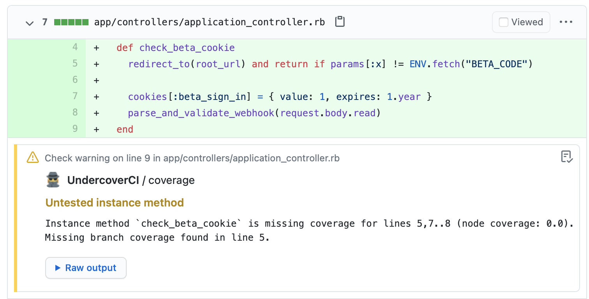

# UndercoverCI

[](https://github.com/grodowski/undercover-ci/actions/workflows/ruby.yml)

GitHub Checks with code coverage warnings from [undercover](https://github.com/grodowski/undercover), detecting when code being changed is untested.

Works with Ruby and GitHub.



## Installation

Sign up on [https://undercover-ci.com](https://undercover-ci.com) to set it up with your CI pipeline.

#### 1. Report test coverage with simplecov

```
require 'simplecov'
require 'simplecov-lcov'
SimpleCov::Formatter::LcovFormatter.config.report_with_single_file = true
SimpleCov.formatter = SimpleCov::Formatter::LcovFormatter
SimpleCov.start do
  add_filter(/^\/spec\//) # For RSpec, use `test` for MiniTest
end
````

#### 2. Upload coverage data after running tests

UndercoverCI accepts LCOV-formatted coverage reports. Please use the `simplecov-lcov` gem to generate them when running your specs. Then you should be able to create a build step uploading the coverage file with `uploader.rb`.

Example:
```
ruby -e "$(curl -s https://undercover-ci.com/uploader.rb)" -- \
  --repo grodowski/undercover-ci \
  --commit $TRAVIS_COMMIT \
  --lcov coverage/lcov/undercover-ci.lcov
```

#### 3. Receive GitHub checks for commits and pull request

## Development and contributing

Here's a short summary of the development feeback loop with webhooks delivered through `ngrok`.

1. Start `rails s`. ActiveJob jobs are processed synchronously in `development`, so that's all you need.

2. Start `ngrok http 3000` to accept webhooks locally.

3. Configure the UndercoverCI (DEV) on GitHub to to point at your `ngrok` url

4. Make a test commit in `twitchy-tortoise/undercover-test` or any other test app that has UndercoverCI (DEV) installed.

5. Push it

```
git commit --amend -m  "test with branch cov" && git push -f
```

6. Send a fake coverage report using the uploader API with the `--url` flag pointing to the local server:

```
ruby -e "$(curl -s https://undercover-ci.com/uploader.rb)" -- \
                  --repo twitchy-tortoise/undercover-test \
                  --commit $(git rev-parse HEAD) \
                  --lcov coverage/lcov/undercover-test.lcov \
                  --url http://localhost:3000/v1/coverage
201
```

7. Check out app logs for errors and see the newly created GitHub Check on the commit.
