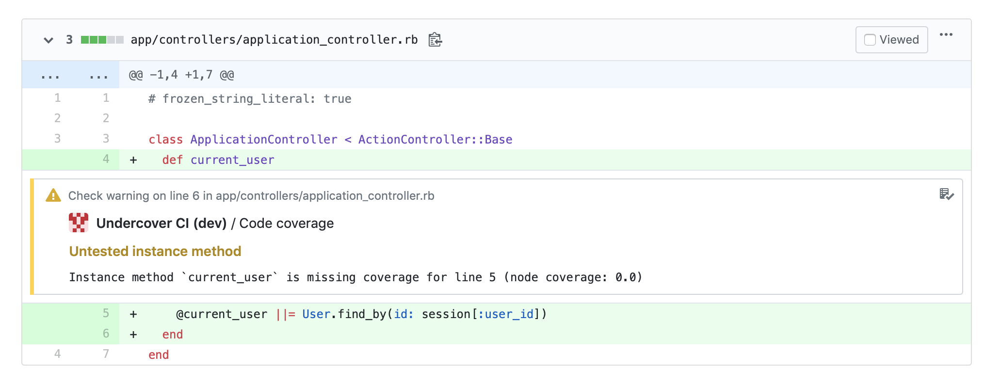

# UndercoverCI

GitHub Checks with code coverage warnings from [undercover](https://github.com/grodowski/undercover).

## Installation

Sign up on [https://undercover-ci.com](https://undercover-ci.com) to set it up with your CI pipeline.

#### 1. Report test coverage with simplecov

```
require 'simplecov'
require 'simplecov-lcov'
SimpleCov::Formatter::LcovFormatter.config.report_with_single_file = true
SimpleCov.formatter = SimpleCov::Formatter::LcovFormatter
SimpleCov.start do
  add_filter(/^\/spec\//) # For RSpec, use `test` for MiniTest
end
````

#### 2. Upload coverage data after running tests

UndercoverCI accepts LCOV-formatted coverage reports. Please use the `simplecov-lcov` gem to generate them when running your specs. Then you should be able to create a build step uploading the coverage file with `uploader.rb`.

Example:
```
ruby -e "$(curl -s https://undercover-ci.com/uploader.rb)" -- \
  --repo grodowski/undercover-ci \
  --commit $TRAVIS_COMMIT \
  --lcov coverage/lcov/undercover-ci.lcov
```

#### 3. Receive GitHub checks for commits and pull request



## Development and contributing

TODO
